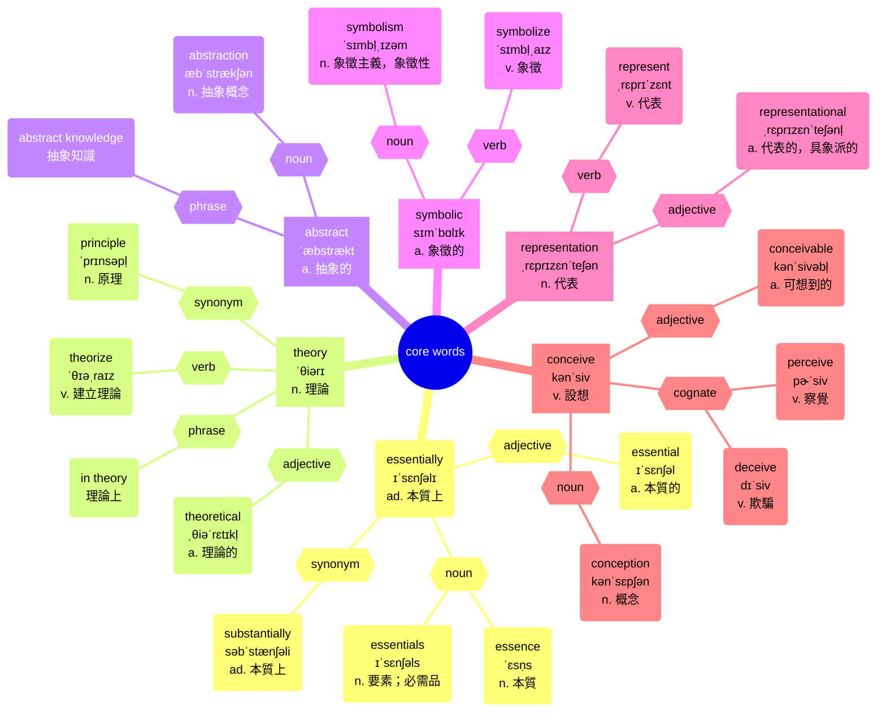

# sentence 001: Language

# Author: Caesar James LEE

## Sentence

Essentially, a theory is an abstract, symbolic representation of what is conceived to be reality.

本質上，理論是一種對被認為是真實世界的抽象且符號性的表徵。

### analysis

```
[Essentially] = 副詞修飾語（修飾整句話）
主句結構：
┌───主詞───┐ ┌─動詞─┐ ┌───────────主詞補語（補語）──────────┐
[A theory]   [is]    [an abstract, symbolic representation]
                                        │
                        介系詞片語（修飾 "representation"）
                                        ↓
                        [of what is conceived to be reality]
                        └─────────── 名詞子句 ──────────────┘
```

## core words



## related words

```mermaid
    flowchart LR;
    %%root
    language([language])
    language --> accent[[accent]]
    language --> pronunciation[[pronunciation]]
    language --> word[[word]]
    language --> learning[[learning]]
    language --> subject[[subject]]

    %%accent branch
    accent --> accentWord(accent<br>'æksɛnt<br>n. 口音)
    accent --> dialect(dialect<br>ˈdaɪǝlɛkt<br>方言)
    accentWord --> |phrase|foreignAccent((foreign accent<br>外國口音));

    %%pronunciation branch
    pronunciation --> vowel(vowel<br>ˈvaʊǝl<br>n. 母音)
    pronunciation --> consonant(consonant<br>ˈkɑnsǝnǝnt<br>n. 子音)
    pronunciation --> syllable(syllable<br>ˈsɪlǝbḷ<br>n. 音節)
    pronunciation --> oral(oral<br>ˈorǝl<br>a. 口頭的)
    pronunciation --> phonetic(phonetic<br>foˈnɛtɪk<br>a. 語音的)
    phonetic --> phoneticAlphabet((phonetic alphabet<br>音標));
    pronunciation --> phonology(phonology<br>foˈnɑlǝdʒɪ<br>n. 音系學)

    %%word branch
    word --> synonym(synonym<br>ˈsɪnǝˌnɪm<br>n. 同義字)
    word --> antonym(antonym<br>ˈæntǝˌnɪm<br>n. 反義字)
    word --> cognate(cognate<br>ˈkɑɡˌnеt<br>n. 同源字)
    word --> root(root<br>rut<br>n. 字根)
    word --> affix(affix<br>ǝˈfɪks<br>字綴)
    word --> prefix(prefix<br>ˈpriˌfɪks<br>字首)
    word --> suffix(suffix<br>ˈsʌfɪks<br>字尾)
    word --> diction(diction<br>ˈdɪkʃǝn<br>n. 用詞)
    word --> verbal(verbal<br>ˈvɝbḷ<br>a. 動詞的，字句的)
    verbal --> verbalize((verbalize<br>ˈvɝbǝˌlaɪz<br>v. 用言語表達));
    word --> lexicology(lexicology<br>ˌlɛksɪˈkɑlǝdʒɪ<br>n. 辭彙學)
    word --> intricate(intricate<br>ˈɪntrǝkɪt<br>a. 難理解的)
    intricate --> |synonym|complex((complex<br>ˈkɑmplɛks<br>a. 難理解的));

    %%learning branch
    learning --> bilingual(bilingual<br>baɪˈlɪŋɡwǝl<br>a. 雙語的)
    bilingual --> |phrase|bilingualLecturing((bilingual lecturing<br>雙語教學));
    learning --> cognitive(cognitive<br>ˈkɑɡnǝtɪv<br>a. 認知的)
    learning --> corpus(corpus<br>ˈkɒrpǝs<br>n. 素材)

    %%subject branch
    subject --> linguistics(linguistics<br>lɪŋˈɡwɪstɪks<br>n. 語言學)
    linguistics --> linguist((linguist<br>ˈlɪŋɡwɪst<br>n. 語言學者));
    linguistics --> linguistic((linguistic<br>lɪŋˈɡwɪstɪk<br>a. 語言學的));
    subject --> morphology(morphology<br>mɒrˈfɑlǝdʒɪ<br>n. 形態學)
    subject --> semantics(semantics<br>sǝˈmæntɪks<br>n. 語義學)

    %%language phrase branch
    language --> |phrase|languageAcquisition(language acquisition<br>ˈlæŋɡwɪdʒ ˌækwǝˈzɪʃǝn<br>語言獲得)
    language --> |phrase| languageFamily(language family<br>語系)
```

