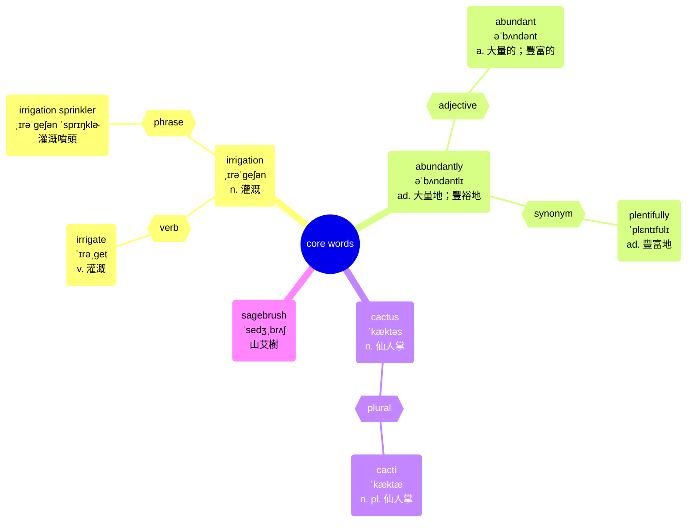

# sentence 002: Agriculture

# Author: Caesar James LEE

## Sentence

Thanks to modern irrigation, crops now grow abundantly in areas where once nothing but cacti and sagebrush could live.

多虧現代灌溉技術，作物現在在過去只有仙人掌和鼠尾草能夠生長的地方茂盛生長。

### analysis

```
[Thanks to modern irrigation] = 介系詞片語（修飾整句）

主句結構：
┌─主詞─┐ ┌─動詞─┐ ┌─副詞片語（補語）─┐
[crops]  [grow]  [abundantly]
            │
    介系詞片語（修飾動詞）
            ↓
        [in areas]
            │
    關係副詞子句（修飾 "areas"）
            ↓
[where once nothing but cacti and sagebrush could live]
└─────────────── 名詞子句（關係副詞子句）──）────────────┘
```

## core words



## related words

```mermaid
    flowchart LR;
    root([agriculture])
    root --> field[[filed]]
    root --> growing[[growing]]
    root --> harvest[[harvest]]
    root --> equipments[[equipments]]
    root --> vegetation[[vegetation]]

    %%filed branch
    field --> agricultural(agricultural<br>ˌæɡrɪˈkʌltʃǝrǝl<br>a. 農業的)
    agricultural --> |phrase|agriculturalProduction((agricultural production<br>ˌæɡrɪˈkʌltʃǝrǝl prǝˈdʌkʃǝn<br>農業生產))
    field --> agrarian(agrarian<br>ǝˈɡrɛrɪǝn<br>a. 土地的，耕地的)
    agrarian --> |phrase|agrarianReform((agrarian reform<br>ǝˈɡrɛrɪǝn ˌrɪˈfɒrm<br>土地改革))
    field --> arable(arable<br>ˈærǝbḷ<br>a. 適於耕種的)
    arable --> |phrase|arableLand((arable land<br>ˈærǝbḷ lænd<br>耕地))
    field --> arid(arid<br>ˈærɪd<br>a. 乾旱的；不毛的)
    arid --> |synonym|barren((barren<br>ˈbærǝn<br>a. 貧瘠的))
    arid --> |synonym|infertile((infertile<br>ɪnˈfɝtɪl<br>a. 不肥沃的))

    %% growing branch
    growing --> fertilizer(fertilizer<br>ˈfɝtlˌaɪzɚ<br>n. 肥料)
    fertilizer --> |phrase|organicFertilizer((organic fertilizer<br>ɒrˈɡænɪk ˈfɝtlˌaɪzɚ<br>有機肥料))
    growing --> herbicide(herbicide<br>ˈhɝbǝˌsaɪd<br>n. 除草劑)
    herbicide --> herb(herb<br>hɝb<br>n. 草本植物；藥草)
    growing --> pesticide(pesticide<br>ˈpɛstɪˌsaɪd<br>n. 殺蟲劑)
    pesticide --> pest(pest<br>pɛst<br>n. 害蟲)
    growing --> weed(weed<br>wid<br>n. 雜草)

    %% harvest branch
    harvest --> cultivate(cultivate<br>ˈkʌltǝˌvеt<br>v. 耕種)
    harvest --> reap(reap<br>rip<br>v. 收割（莊稼）)
    reap --> reaper(reaper<br>ˈripɚ<br>n. 收割者；收割機)
    harvest --> yield(yield<br>jild<br>v. 結出（果實）<br>n. 產量；收益)
    yield --> |synonym|output(ˈaʊtˌpʊt<br>n. 出產；產量；產品；輸出<br>v. 生產；輸出)
    harvest --> barn(barn<br>bɑrn<br>n. 糧倉)
    harvest --> warehouse(warehouse<br>ˈwɛrˌhaʊs<br>n. 倉庫)
    harvest --> prolific(prolific<br>prǝˈlɪfɪk<br>a. 多產的)
    prolific --> |synonym|productive((productive<br>prǝˈdʌktɪv<br>a. 多產的；生產的))
    
    %% equipments branch
    equipments --> baleLoader(bale loader<br>bеl ˈlodɚ<br>裝草機；草捆裝運機)
    baleLoader --> bale(bale<br>bеl<br>n. 大捆<br>v. 將……打成大包)
    equipments --> tractor(tractor<br>ˈtræktɚ<br>n. 牽引機；拖拉機)
    tractor --> tract(tract<br>trækt<br>n. 大片土地)
    equipments --> binder(binder<br>ˈbaɪndɚ<br>n. 割捆機；（書籍）裝訂工)
    equipments --> clodCrusher(clod crusher<br>klɑd ˈkrʌʃɚ<br>n. 土塊粉碎機)
    clodCrusher --> clod(clod<br>klɑd<br>n. 土塊)
    equipments --> farmMachine(farm machine<br>fɑrm mǝˈʃin<br>農業機器)
    equipments --> fieldRoller(field roller<br>fild ˈrolɚ<br>n. 田間壓路機)
    equipments --> mower(mower<br>ˈmoɚ<br>n. 刈草機；收割機)
    mower --> mow(mow<br>mo<br>v. （用鐮刀等）刈（草等）)
    equipments --> pump(pump<br>pʌmp<br>n. 泵<br>v. 用筒抽（水等）)
    pump --> |phrase|waterPump((water pump<br>ˈwɒtɚ pʌmp<br>水泵))
    equipments --> harvester(harvester<br>ˈhɑrvɪstɚ<br>n. 收割者；收割機)
    equipments --> seeder(seeder<br>ˈsidɚ<br>n. 播種者；播種機)
    equipments --> thresher(thresher<br>ˈθrɛʃɚ<br>n. 脫粒機)
    thresher --> thresh(thresh<br>θrɛʃ<br>n. & v. 打穀)
    equipments --> weeder(weeder<br>ˈwidɚ<br>n. 除草者；除草機)
    weeder --> |phrase|weedingMachine((weeding machine<br>ˈwidɪŋ mǝˈʃin<br>n. 除草者；除草機))

    %% vegetation branch
    vegetation --> vegetationWord(vegetation<br>ˌvɛdʒǝˈtеʃǝn<br>n. 植被)
    vegetationWord --> |synonym|plant((plant<br>plænt<br>n. 植物))
    vegetation --> flora(flora<br>ˈflorǝ<br>n. 植物群)
    flora --> floral(floral<br>ˈflorǝl<br>a. 植物群的；似花的)
    vegetation --> willow(willow<br>ˈwɪlo<br>n. 柳，柳樹)
    vegetation --> poplar(poplar<br>ˈpɑplɚ<br>n. 楊屬樹木，白楊)
    vegetation --> palm(palm<br>pɑm<br>n. 棕櫚（樹）)
    vegetation --> pine(pine<br>paɪn<br>n. 松樹)
    pine --> pineapple(pineapple<br>ˈpaɪnˌæpḷ<br>n. 鳳梨)
    vegetation --> shrub(shrub<br>ʃrʌb<br>n. 矮樹；灌木)
    vegetation --> alga(alga<br>ˈælɡǝ<br>n. 水藻，海藻)
    alga --> algae(algae<br>ˈældʒi<br>n. pl. 水藻，海藻)
    alga --> |synonym|seaweed(seaweed<br>ˈsiˌwid<br>n. 海藻)
    vegetation --> fern(fern<br>fɝn<br>n. 蕨)
    vegetation --> moss(moss<br>mɒs<br>n. 苔蘚；地衣)
    vegetation --> tundra(tundra<br>ˈtʌndrǝ<br>n. 苔原)
    vegetation --> scrubland(scrubland<br>ˈskrʌbˌlænd<br>n. 灌木叢林地)
    vegetation --> bark(bark<br>bɑrk<br>v. 吠叫；剝去（樹等）的皮<br>n. 吠聲；樹皮；三桅帆船)
    vegetation --> trunk(trunk<br>trʌŋk<br>n. 樹幹)
    trunk --> |synonym|stem(stem<br>stɛm<br>n. 莖，（樹）幹)
    vegetation --> twig(twig<br>twɪɡ<br>n. 細枝，嫩枝)
    vegetation --> evergreen(evergreen<br>ˈɛvɚˌɡrin<br>a. 常綠的，常青的)
    vegetation --> cluster(cluster<br>ˈklʌstɚ<br>n. （花等的）束，簇)
    cluster --> |phrase|clusterFlower((a cluster of flower<br>ǝ ˈklʌstɚ ɑv ˈflaʊɚ<br>一簇花))
```
