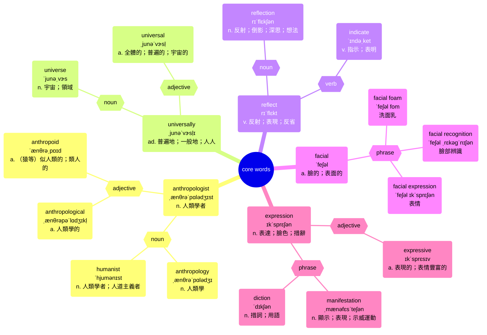

# sentence 003: Human

# Author: Caesar James LEE

## Sentence

Anthropologists have discovered that fear, happiness, sadness, and surprise are universally reflected in facial expressions.

人類學家發現，恐懼、快樂、悲傷和驚訝這些情緒會普遍地反映在面部表情中。

### analysis

```
主句結構：
┌──────主詞──────┐ ┌──────動詞──────┐ ┌─受詞子句─┐
[Anthropologists]  [have discovered] [that...]
                                        |
┌─────────────────主詞──────────────────┐ ┌─動詞（被動語態）─┐ ┌──────地點副詞片語─────┐
[fear, happiness, sadness, and surprise]  [are reflected]     [in facial expressions]
                                                 ↑
                             副詞「universally」修飾被動動詞，表示「普遍地」

```

## core words


## related words

```mermaid
    flowchart LR;
    human([human]) --> fear[[fear]];
    human --> happy[[happy]];
    human --> sad[[sad]];
    human --> surprise[[surprise]];
    human --> expert[[expert]];

    %%fear branch
    fear --> aghast(aghast<br>ǝˈɡæst<br>a. 嚇呆的；驚駭的)
    aghast --> |preposition|aghastAt((aghast at<br>驚呆))
    fear --> appall(appall<br>ǝˈpɒl<br>v. 使驚恐，使膽寒)
    appall --> appalling(appalling<br>ǝˈpɒlɪŋ<br>a. 駭人的，可怕的)
    fear --> craven(craven<br>ˈkrеvǝn<br>a. 怯懦的，卑怯的<br>n. 懦夫，膽小鬼)
    craven --> |synonym|coward((coward<br>ˈkaʊɚd<br>n. 懦夫，膽怯者<br>a. 懦怯的，膽小的))
    fear --> creep(creep<br>krip<br>v. 躡手躡足地走；爬行；（由於恐懼，厭惡等）起雞皮疙瘩<br>n. 爬；毛骨悚然的感覺)
    creep --> creepy(creepy<br>ˈkripɪ<br>a. 令人毛骨悚然的；蠕動的)
    fear --> dread(dread<br>drɛd<br>v. 懼怕；擔心<br>n. 畏懼；恐怖；擔心<br>a. 令人畏懼的)
    fear --> dreadful(dreadful<br>ˈdrɛdfǝl<br>a. 可怕的；令人敬畏的)
    fear --> fright(fright<br>fraɪt<br>n. 驚嚇<br>v. 【書】使驚恐)
    fright --> |phrase|stageFright((stage fright<br>stеdʒ fraɪt<br>怯場))
    fear --> petrified(petrified<br>ˈpɛtrɪfaɪd<br>a. 驚呆的)
    petrified --> petrify(petrify<br>ˈpɛtrǝˌfaɪ<br>v. 使石化；使驚呆)
    fear --> terrified(terrified<br>ˈtɛrǝˌfaɪd<br>a. 恐懼的)
    terrified --> |preposition|beTerrifiedOf((be terrified of<br>害怕))
    fear --> terrify(terrify<br>ˈtɛrǝˌfaɪ<br>v. 使害怕)
    fear --> timid(timid<br>ˈtɪmɪd<br>膽小的)
    timid --> |phrase|asTimidAsHare((as timid as hare<br>æz ˈtɪmɪd æz hɛr<br>膽小如兔（鼠）))
    asTimidAsHare --> hare(hare<br>hɛr<br>野兔)
    fear --> tremble(tremble<br>ˈtrɛmbḷ<br>n. 發抖<br>v. 發抖)
    tremble --> trembling(trembling<br>ˈtrɛmbḷɪŋ<br>n. 發抖<br>a. 發抖的)

    %%happy branch
    happy --> ecstasy(ecstasy<br>ˈɛkstǝsɪ<br>n. 狂喜)
    ecstasy --> ecstatic(ecstatic<br>ɛkˈstætɪk<br>a. 狂喜的)
    happy --> exaltation(exaltation<br>ˌɛɡzɒlˈtеʃǝn<br>n. 欣喜)
    exaltation --> exalt(exalt<br>ɪɡˈzɒlt<br>v. 使喜悅)
    happy --> gratify(gratify<br>ˈɡrætǝˌfaɪ<br>使高興)
    gratify --> gratification(gratification<br>ˌɡrætǝfǝˈkеʃǝn<br>滿意)
    happy --> grin(grin<br>ɡrɪn<br>v. 露齒而笑)
    grin --> |phrase|grinAndBearIt((grin and bear it<br>ɡrɪn ænd bɛr ɪt<br>默默忍受))
    happy --> intoxicate(intoxicate<br>ɪnˈtɑksǝˌkеt<br>使喝醉；使狂喜)
    intoxicate --> intoxication(intoxication<br>ɪnˌtɑksǝˈkеʃǝn<br>陶醉)
    happy --> merry(merry<br>ˈmɛrɪ<br>愉快的)
    merry --> merrily(merrily<br>ˈmɛrɪlɪ<br>愉快地)
    happy --> mirth(mirth<br>mɝθ<br>n. 歡笑；高興)
    happy --> overjoyed(overjoyed<br>ˌovɚˈdʒɒɪd<br>a. 極度高興的)
    overjoyed --> |preposition|overjoyedAt((overjoyed at<br>因...欣喜若狂))
    happy --> rejoice(rejoice<br>rɪˈdʒɒɪs<br>高興；欣喜)
    rejoice --> |preposition|rejoiceIn((rejoice in<br>因...感到欣喜))

    %%sed branch
    sad --> aggrieve(aggrieve<br>ǝˈɡriv<br>使悲痛；使受屈)
    sad --> agony(agony<br>ˈæɡǝnɪ<br>極度痛苦；苦惱)
    agony --> |preposition|inAgony((in agony<br>痛苦中))
    sad --> anguish(anguish<br>ˈæŋɡwɪʃ<br>n. 痛苦)
    anguish --> inAnguish(in anguish<br>痛苦中)
    sad --> deplore(deplore<br>dɪˈplor<br>深感悲痛)
    sad --> distress(distress<br>dɪˈstrɛs<br>n. 危難；不幸<br>v. 使悲痛；使苦惱)
    distress --> |phrase|distressSignal((distress signal<br>求救訊號))
    sad --> dolefulness(dolefulness<br>ˈdolfǝlnǝs<br>悲哀)
    dolefulness --> doleful(doleful<br>ˈdolfǝl<br>悲傷的)
    sad --> grief(grief<br>ɡrif<br>悲傷；不幸)
    grief --> |phrase|comeToGrief((come to grief<br>遭遇不幸))
    grief --> grieve(grieve<br>ɡriv<br>使悲傷)
    grieve --> |phrase|grieveFor((grieve for<br>悲傷))
    sad --> lament(lament<br>lǝˈmɛnt<br>哀悼；痛哭)
    sad --> misery(misery<br>ˈmɪzǝrɪ<br>痛苦；窮困)
    misery --> LiveInMiseryAndWant((live in misery and want<br>生活在痛苦和匱乏之中))
    sad --> mourn(mourn<br>哀悼)
    mourn --> |phrase|mournFor((mourn for<br>為...哀悼))
    sad --> sorrow(sorrow<br>ˈsɑro<br>悲痛；傷心事)
    sorrow --> |preposition|sorrowAt((sorrow at<br>對...悲傷))
    sad --> torment(torment<br>ˈtɒrˌmɛnt<br>n. 痛苦)
    torment --> |phrase|innerTorment((inner torment<br>內心的折磨))

    %%surprise branch
    surprise --> astonish(astonish<br>ǝˈstɑnɪʃ<br>v. 使吃驚，使驚訝)
    astonish --> astonishAt(astonish at<br>驚訝於)
    surprise --> astound(astound<br>ǝˈstaʊnd<br>使震驚)
    astound --> astounding(astounding<br>ǝˈstaʊndɪŋ<br>a. 令人震驚的)
    surprise --> fabulous(fabulous<br>ˈfæbjǝlǝs<br>a. 難以置信的)
    surprise --> inconceivable(inconceivable<br>ˌɪnkǝnˈsivǝbḷ<br>a. 不可思議的)
    inconceivable --> inconceivableDisaster(inconceivable disaster<br>難以想像的災難)
    surprise --> incredible(incredible<br>ɪnˈkrɛdǝbḷ<br>a. 難以置信的)
    incredible --> incredibleStyle(incredible style<br>令人難以置信的風格)
    surprise --> marvelous(marvelous<br>ˈmɑrvǝlǝs<br>a. 令人驚歎的)
    marvelous --> marvel(marvel<br>ˈmɑrvḷ<br>驚異)
    surprise --> startle(startle<br>ˈstɑrtḷ<br>v. 驚嚇)
    startle --> |phrase|startleResponse((startle response<br>驚嚇反應))
    surprise --> striking(striking<br>ˈstraɪkɪŋ<br>a. 惹人注目的)
    striking --> strike(strike<br>straɪk<br>v. 擊打<br>n. 罷工)
    surprise --> stunning(stunning<br>ˈstʌnɪŋ<br>a. 令人震驚的)
    stunning --> stun(stun<br>stʌn<br>v. 把...打昏；使大吃一驚<br>n. 昏迷)

    %%expert branch
    expert --> aesthetician(aesthetician<br>ˌɛsθǝˈtɪʃǝn<br>醫美師，美容師)
    aesthetician --> aesthetics(aesthetics<br>ɛsˈθɛtɪks<br>n. 美學)
    expert --> archaeologist(archaeologist<br>ˌɑrkɪˈɑlǝdʒɪst<br>n. 考古學家)
    archaeologist --> archaeology(archaeology<br>ˌɑrkɪˈɑlǝdʒɪ<br>n. 考古學)
    expert --> astronomer(astronomer<br>ǝˈstrɑnǝmɚ<br>n. 天文學家)
    astronomer --> astronomy(astronomy<br>ǝsˈtrɑnǝmɪ<br>n. 天文學)
    expert --> ecologist(ecologist<br>ɪ'kɑlədʒɪst<br>n. 生態學者)
    ecologist --> ecology(ecology<br>ɪ'kɑlədʒɪ<br>n. 生態學)
    expert --> ethnologist(ethnologist<br>ɛθ'nɑlədʒɪst<br>n. 人種學者)
    ethnologist --> ethnology(ethnology<br>ɛθ'nɑlədʒɪ<br>n. 人種學)
    expert --> entomologist(entomologist<br>ˌɛntə'mɑlədʒɪst<br>n. 昆蟲學家)
    entomologist --> entomology(entomology<br>ˌɛntə'mɑlədʒɪ<br>n. 昆蟲學)
    expert --> linguistician(linguistician<br>ˌlɪŋgwəs'tɪʃən<br>n. 語言學家)
    linguistician --> linguistics(linguistics<br>lɪŋ'gwɪstɪks<br>n. 語言學)
    expert --> neurologist(neurologist<br>njʊ'rɑlədʒɪst<br>n. 神經學家)
    neurologist --> neurology(neurology<br>njʊ'rɑlədʒɪ<br>n. 神經學)
    expert --> ornithologist(ornithologist<br>ˌɒrnǝˈθǝlɑdʒɪst<br>n. 鳥類學家)
    ornithologist --> ornithology(ornithology<br>ˌɒrnɪˈθɑlǝdʒɪ<br>n. 鳥類學)
    expert --> pathologist(pathologist<br>pæˈθɑlǝdʒɪst<br>n. 病理學家)
    pathologist --> pathology(pathology<br>pæˈθɑlǝdʒɪ<br>n. 病理學)
    expert --> taxonomist(taxonomist<br>tæksˈɑnǝmɪst<br>n. 分類學者)
    taxonomist --> taxonomy(taxonomy<br>tækˈsɑnǝmɪ<br>n. 分類學)
    expert --> astrologer(astrologer<br>ǝˈstrɑlǝdʒɚ<br>n. 占星家)
    astrologer --> astrology(astrology<br>ǝˈstrɑlǝdʒɪ<br>n. 占星學)
    expert --> physiologist(physiologist<br>ˌfɪzɪˈɑlǝdʒɪst<br>n. 生理學家)
    physiologist --> physiology(physiology<br>ˌfɪzɪ'ɑlədʒɪ<br>n. 生理學)
    expert --> geologist(geologist<br>dʒɪ'ɑlədʒɪst<br>n. 地質學家)
    geologist --> geology(geology<br>dʒɪ'ɑlədʒɪ<br>n. 地質學)
    expert --> meteorologist(meteorologist<br>ˌmitɪə'rɑlədʒɪst<br>n. 氣象學者)
    meteorologist --> meteorology(meteorology<br>ˌmitɪəˋrɑlədʒɪ<br>n. 氣象學)
    expert --> oceanographer(oceanographer<br>ˌoʃɪə'nɑgrəfɚ<br>n. 海洋學家)
    oceanographer --> oceanography(oceanography<br>ˌoʃɪə'nɑgrəfɪ<br>n. 海洋學)
    expert --> paleontologist(paleontologist<br>ˌpelɪɑn'tɑlədʒɪst<br>n. 古生物學者)
    paleontologist --> paleontology(paleontology<br>ˌpelɪɑn'tɑlədʒɪ<br>n. 古生物學)
    expert --> demographer(demographer<br>dɪ'mɑgrəfɚ<br>n. 人口統計學家)
    demographer --> demography(demography<br>di'mɑgrəfɪ<br>n. 人口統計學)
    expert --> philosopher(philosopher<br>fə'lɑsəfɚ<br>n. 哲學家)
    philosopher --> philosophy(philosophy<br>fə'lɑsəfɪ<br>n. 哲學)
    expert --> seismologist(seismologist<br>saɪz'mɑlədʒɪst<br>n. 地震學家)
    seismologist --> seismology(seismology<br>saɪz'mɑlədʒɪ<br>n. n.地震學)
```

